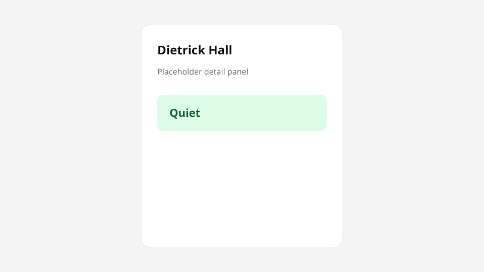
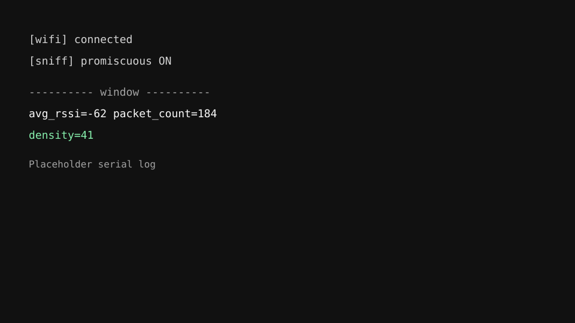

<p align="center">
  
</p>

<p align="center">
  <strong>Ambient WiFi density · ESP32 · Supabase · Next.js campus map</strong>
</p>

<p align="center">
  
  
  
  
  
  
</p>

<p align="center">
  <a href="#quick-start">Quick start</a> ·
  <a href="#usage">Usage</a> ·
  <a href="#architecture">Architecture</a> ·
  <a href="./NEXT_STEPS.md">Roadmap</a> ·
  <a href="./PRESENTATION.md">Pitch script</a>
</p>

---

**Packed** is a **privacy-preserving campus busyness sensor**. One cheap ESP32 listens to ambient WiFi noise (aggregates only — no MACs), turns that into a **0–100 density score**, and a Next.js map shows **Quiet / Moderate / Busy** so you can skip the packed line.

If you want **“how busy is this dining hall right now?”** without cameras, without tracking phones, and without a campus IT integration — use Packed.

> **Status:** hackathon MVP. Single live sensor at Dietrick Hall (Virginia Tech). Demo mode seeds the rest of the map.

## Table of contents

- [Why Packed](#why-packed)
- [Screenshots](#screenshots)
- [Features](#features)
- [Quick start](#quick-start)
- [Usage](#usage)
- [Architecture](#architecture)
- [Firmware](#firmware)
- [Supabase](#supabase)
- [Web UI](#web-ui)
- [Privacy](#privacy)
- [Requirements](#requirements)
- [Contributing](#contributing)
- [License](#license)

## Why Packed

| You want… | Packed gives you… |
| --- | --- |
| A glanceable “should I go now?” | Quiet / Moderate / Busy on a campus map |
| No cameras, no headcount | Ambient RF: average RSSI + packet activity |
| Hardware you can demo | One ESP32, phone hotspot, HTTPS to Supabase |
| A UI without the sensor | Demo mode with seeded densities + sliders |
| A path to more buildings | Live polls one location; map holds placeholders |

**Not for you if** you need exact occupancy, MAC tracking, entry/exit counting, enterprise campus WiFi auth, or a multi-sensor fusion pipeline. Packed is a **relative busyness kit**, not a people counter.

**Building a pitch?** See [`PRESENTATION.md`](PRESENTATION.md). **After the hackathon?** See [`NEXT_STEPS.md`](NEXT_STEPS.md).

## Screenshots







*Art in `art/` is temporary placeholder SVG. Swap in real captures when you have them.*

## Features

- **Aggregates only** — firmware never extracts or stores MAC addresses
- **On-device density** — 5-minute windows (or 30s short env), 0–100 accumulator
- **Hotspot uplink** — ESP32 STA on a phone AP, not campus WiFi
- **Supabase `readings`** — RSSI, packet count, density, location
- **Next.js dashboard** — MapLibre campus map, Demo / Live toggle
- **Recommendation strip** — quieter spot when densities actually differ
- **Dark mode** — first-class theme on the web app
- **Hackathon-honest Live** — one real sensor; other pins are placeholders

## Quick start

### Web (no hardware)

```bash
cd web
cp .env.example .env.local   # Supabase URL + anon key
pnpm install
pnpm dev
```

Open [http://localhost:3000](http://localhost:3000). Demo is the default. Use the **Demo** / **Live** toggle, or `?demo=1` / `?live=1`.

### Firmware (ESP32)

```text
firmware/include/config.h.example  →  firmware/include/config.h
```

Fill `WIFI_SSID` / `WIFI_PASSWORD` (phone hotspot), `SUPABASE_URL` / `SUPABASE_API_KEY` (anon key), optional `LOCATION_ID` (default `dining_hall_main`). Build and upload with [PlatformIO](https://platformio.org/). Serial at **115200**.

That is the path: **copy env → run the map**, or **copy `config.h` → flash the sensor**.

## Usage

### Status bands

| Density | Label |
| --- | --- |
| 0–33 | Quiet |
| 34–66 | Moderate |
| 67–100 | Busy |

### Demo vs Live

- **Demo** — seeded crowd levels and sliders. No ESP32 required. Best for the multi-building “go here, not there” story.
- **Live** — polls Supabase for `dining_hall_main` about every 30s. Honest story today: how packed is Dietrick.

### Venue loop

1. Phone hotspot on; ESP32 powered; Serial shows connect + sniff.
2. Wait one window (or `esp32dev_short`); confirm a row in Supabase.
3. Open the app → **Live**; status should match density.
4. Walk the chokepoint; watch Serial `%Δ` and retune thresholds.

## Architecture

```
Ambient WiFi frames
  → ESP32 (promiscuous sniff, on-device density)
  → Phone hotspot (STA uplink)
  → Supabase `readings`
  → Next.js app in web/ (Demo locally, Live poll ~30s)
```

## Repo layout

| Path | Purpose |
| --- | --- |
| `firmware/` | PlatformIO ESP32 firmware |
| `web/` | Next.js App Router UI (Vercel root) |
| `firmware/include/config.h.example` | WiFi + Supabase secrets template |
| `web/.env.example` | Next.js Supabase env template |
| `art/` | README banner / gallery placeholders |
| [`NEXT_STEPS.md`](NEXT_STEPS.md) | Post-hackathon roadmap |
| [`PRESENTATION.md`](PRESENTATION.md) | Judge demo script |

## Firmware

1. Install PlatformIO (VS Code / Cursor extension is fine).
2. Copy `config.h.example` → `config.h` (gitignored).
3. Open `firmware/`, build & upload.
4. Serial Monitor at **115200**.

### What you should see

```text
[wifi] connected, IP: 192.168.x.x  channel: N
[scan] Nearby APs ...
[sniff] promiscuous ON on channel N
[ready] window=300000 ms ...
---------- window ----------
  avg_rssi=...  packet_count=...
  density=...
[http] POST ok ...
```

### Tunables (`firmware/src/main.cpp`)

| Constant | Default | Meaning |
| --- | --- | --- |
| `RSSI_THRESHOLD` | 10 | % RSSI drop required |
| `PACKET_THRESHOLD` | 15 | % packet-count rise required |
| `STEP_UP` / `STEP_DOWN` | 10 / 5 | Density accumulator steps |
| `WINDOW_MS` | 5 min | Averaging window |

Faster bench: PlatformIO env `esp32dev_short` (30s windows).

### Radio notes

- Default sniff channel = hotspot AP channel (`SNIFF_CHANNEL 0`).
- At the venue, use a WiFi analyzer or the boot `[scan]` log for campus AP channels.
- To sniff another channel, `#define SNIFF_CHANNEL N` — firmware pauses sniff → reconnects STA → POSTs → resumes sniff.
- **Top risk:** promiscuous + STA + HTTPS on one radio. If POST fails while sniffing, check Serial.

## Supabase

Table `public.readings`:

| Column | Type |
| --- | --- |
| `id` | bigint identity PK |
| `created_at` | timestamptz default now() |
| `avg_rssi` | float |
| `packet_count` | int |
| `density` | int 0–100 |
| `location` | text |

RLS for the hackathon demo: anon can `SELECT` and `INSERT`.

Smoke test:

```bash
curl -X POST "https://YOUR_PROJECT.supabase.co/rest/v1/readings" \
  -H "apikey: YOUR_ANON_KEY" \
  -H "Authorization: Bearer YOUR_ANON_KEY" \
  -H "Content-Type: application/json" \
  -H "Prefer: return=representation" \
  -d "{\"avg_rssi\":-60,\"packet_count\":100,\"density\":50,\"location\":\"dining_hall_main\"}"
```

## Web UI

App is standardized on **pnpm**. Copy `web/.env.example` → `web/.env.local`:

- `NEXT_PUBLIC_SUPABASE_URL`
- `NEXT_PUBLIC_SUPABASE_ANON_KEY`

### Deploy on Vercel

1. Import this repo.
2. Set **Root Directory** to `web`.
3. Add the two `NEXT_PUBLIC_SUPABASE_*` env vars (Production + Preview).
4. Deploy. The browser talks to Supabase REST directly — no custom API routes required.

## Privacy

Firmware never reads or stores MAC addresses — only RSSI sums and packet counts. Relative change in the RF environment, not “there are exactly N people.”

## Out of scope

MAC tracking, entry/exit counting, multi-sensor logic, historical “come back in 15 min” prediction, campus WiFi enterprise auth.

## Requirements

- **Web:** Node.js + [pnpm](https://pnpm.io/), Next.js 15
- **Firmware:** PHP not required — PlatformIO + ESP32
- **Backend:** a Supabase project with the `readings` table
- **Demo uplink:** a phone hotspot the ESP32 can join

## Contributing

This started as a VTHacks MVP (formerly Campus Crowd / ProjectSolver). Issues and PRs that tighten calibration, Live coverage, or campus config are welcome. Read [`NEXT_STEPS.md`](NEXT_STEPS.md) before adding product surface.

## License

MIT. See [LICENSE](LICENSE).

---

<p align="center">
  Skip the packed line.
  ·
  <code>Packed</code>
</p>
